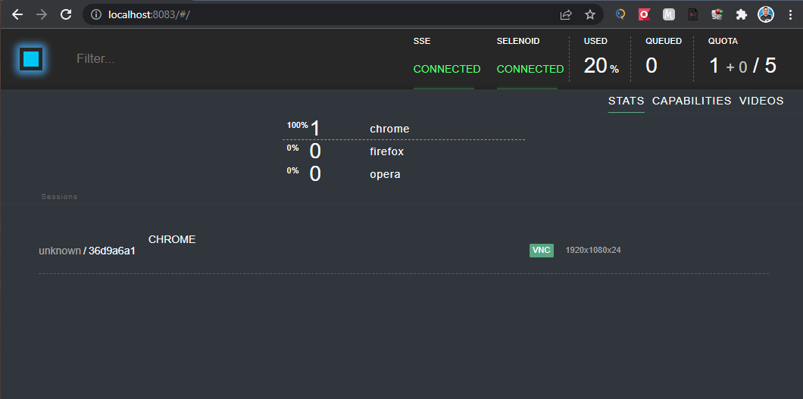
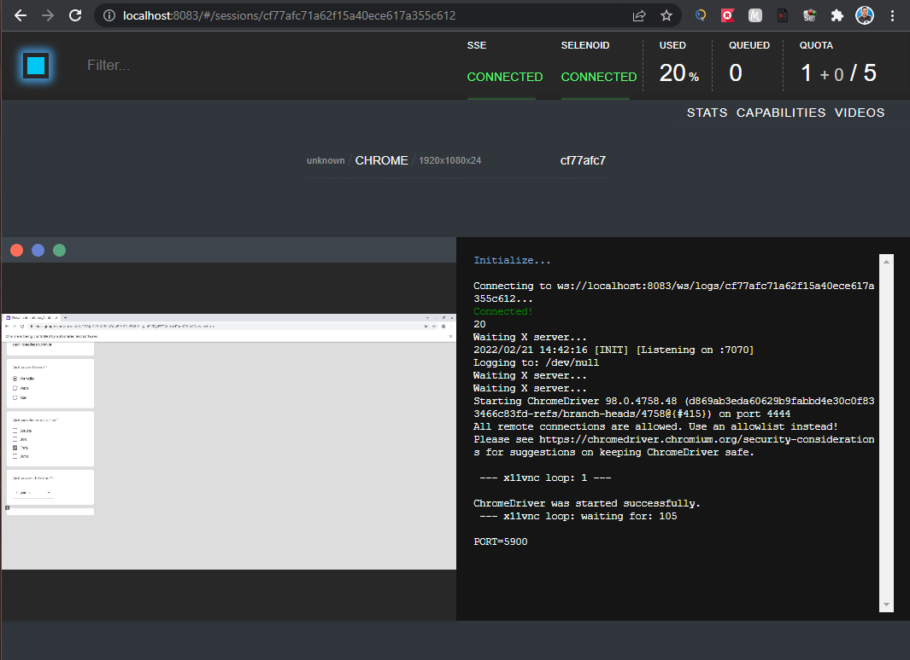

# Selenium Test Google forms

### Prerequisites

* JDK - 1.8

* Maven  

* Docker
    - Selenoid(https://aerokube.com/selenoid/latest/)

## Running Docker

comando Docker para baixa o container:

    docker-compose -f docker-compose.yml up -d 

Caminho para acessar o Selenoid:

    http://localhost:8083/

## Running tests

Executar o comando mvn test para executar os testes automatizados.

Parâmetros:

* mvn test: 

comando mvn test para executar os testes automatizados:

    mvn test

Parametros de execução do cucumber:

	//executa os cenários de testes contendo as tags passadas
        @all @MOBILE @MOBILE